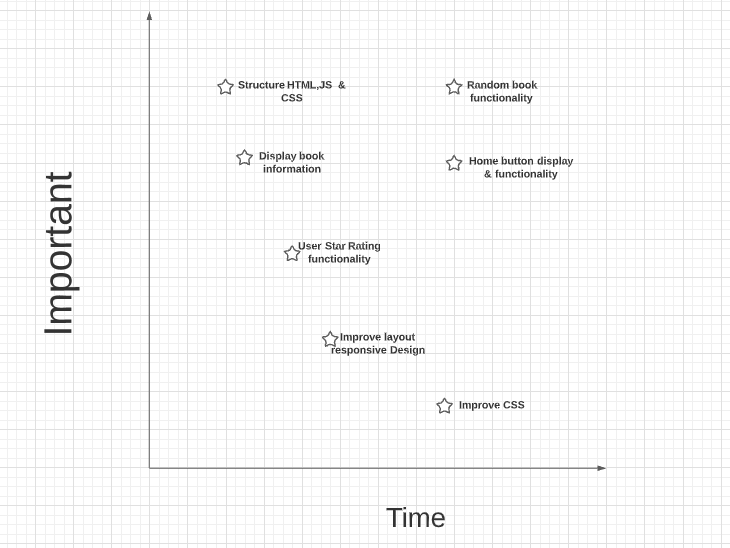

# Project Overview

## NextRead

NEXTREAD

## Project Description

Have you had trouble selecting the next book your going to read? This app will help the user choose the next book by the help of a random generator. Once the user clicks the generator, the app will display the book details. Unlimited tries until you find the perfect book. Think GoodReads but much simpler: https://www.goodreads.com/

## API and Data Sample
https://api.nytimes.com/svc/books/v3/lists/current/hardcover-fiction.json?api-key=YourKey

```json
{
                "rank": 4,
                "rank_last_week": 5,
                "weeks_on_list": 2,
                "asterisk": 0,
                "dagger": 0,
                "primary_isbn10": "0593296672",
                "primary_isbn13": "9780593296677",
                "publisher": "Pamela Dorman",
                "description": "Elin Warner must find her estranged brother’s fiancée, who goes missing as a storm approaches a hotel that was once a sanatorium in the Swiss Alps.",
                "price": "0.00",
                "title": "THE SANATORIUM",
                "author": "Sarah Pearse",
                "contributor": "by Sarah Pearse",
                "contributor_note": "",
                "book_image": "https://storage.googleapis.com/du-prd/books/images/9780593296677.jpg",
                "book_image_width": 331,
                "book_image_height": 500,
                "amazon_product_url": "https://www.amazon.com/dp/0593296672?tag=NYTBSREV-20&tag=NYTBSREV-20",
                "age_group": "",
                "book_review_link": "",
                "first_chapter_link": "",
                "sunday_review_link": "",
                "article_chapter_link": "",
                "isbns": [
                    {
                        "isbn10": "0593296672",
                        "isbn13": "9780593296677"
                    },
                    {
                        "isbn10": "0593296680",
                        "isbn13": "9780593296684"
                    }
                ],
```

## Wireframes

https://wireframe.cc/y2tomy

Home Screen will be the home for the random genrator which when pressed will take you to the Book info page displaying the Book info. Home button will take you back to home page to generate a different book.

#### MVP 

- Random book button functionality
- Acces home screen from book info page via home button
- Allow user to give star review 

#### PostMVP  
- add 2 more button : by age group , by author
- Add second API for list of reviews
- save users book star review

## Project Schedule

|  Day | Deliverable | Status
|---|---| ---|
|Feb 22-23| Project Propsal planning, research possible features | Incomplete
|Feb 23| possible features can be used with APIs & Project Approval | Incomplete
|Feb 23 -24| Set up initial structure for HTML JS and CSS , Psuedocode | Incomplete
|Feb 24| Complete HTML and JavaScript code/ Functionality focus | Incomplete
|Feb 25| CSS work on initial home page(random generator look | Incomplete
|Feb 26| CSS work on 2nd page display book info and user rating | Incomplete
|March 1| Presentations | Incomplete

## Priority Matrix
https://lucid.app/lucidchart/invitations/accept/b359d850-833e-4e09-8578-a2c406b7cc79



## Timeframes

| Component | Priority | Estimated Time | Time Invested | Actual Time |
| --- | :---: |  :---: | :---: | :---: |
| Structure HTML Code | H | 3hrs| hrs | hrs |
| Structure JavaScript| H | 3hrs| hrs | hrs |
| Set Up basic CSS file | H | 3hrs| hrs | hrs |
| Work on displaying 1 button | H | 3hrs| hrs | hrs |
| Random book functionality | H | 3hrs| hrs | hrs |
| Display book information | H | 3hrs| hrs | hrs |
| Work on book cover display | L | 3hrs| hrs | hrs |
| Home button & navigation to home screen | H | 3hrs|  hrs | hrs |
| User Star Rating functionality | M | 3hrs| hrs | hrs |
| Improve look of buttons | L | 3hrs| hrs | hrs |
| Search for perfect App background| L | 3hrs| hrs | hrs |
| Improve layout Responsive Design | M | 3hrs| hrs | hrs|
| Play and test out app | L | 3hrs| hrs | hrs |
| Total | H | 39 hrs| hrs | hrs |

## Code Snippet


## Change Log
 This section documents what changes were made to the app and the reasoning behind those changes.  
